# Encuentro en Alpa Corral: conectividad, territorio y brigadas de fuego

El sábado pasado viajamos a **Alpa Corral**, en el sur de Córdoba, invitados por el equipo de la **Universidad Nacional de Río Negro**, liderado por **Daniel Belomo**, y la **Asociación Civil Tierra Unida Activa**, que impulsan un proyecto de **red comunitaria comunitaria y científica Las Lagunitas Alpa Corral**.
El objetivo de la jornada era compartir experiencias sobre herramientas libres para la gestión del territorio y la comunicación en zonas rurales, con especial foco en el **combate de incendios forestales**.

<!-- truncate -->

## El viaje y la llegada

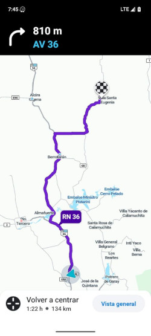

Salimos temprano desde **José de la Quintana**, con Pablo y mi familia, rumbo a Alpa Corral. Fueron unas horas de viaje entre mates y charlas, hasta llegar alrededor de las 9:20 de la mañana.

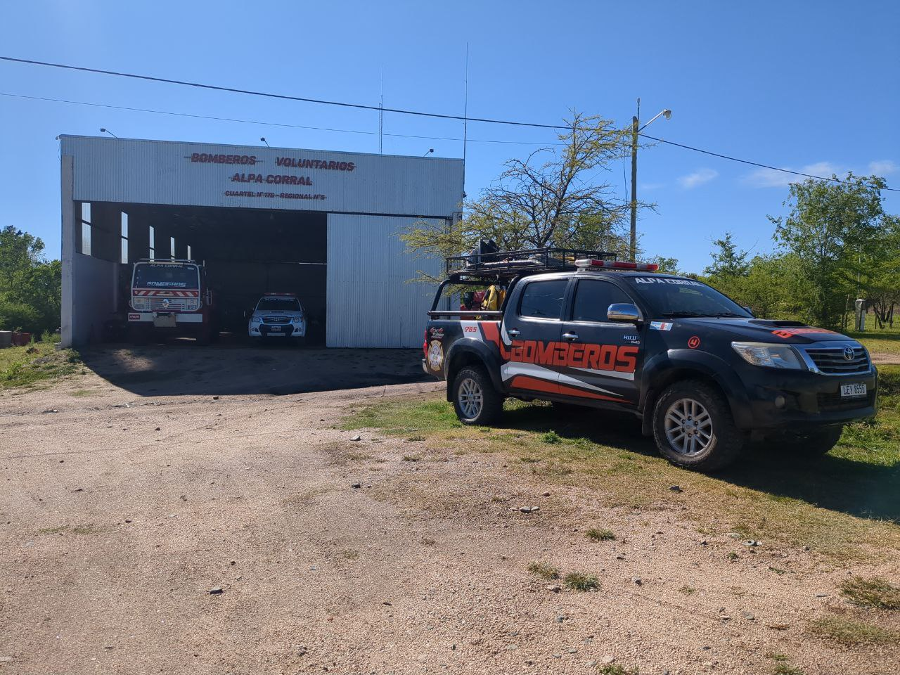

Nos recibieron en el **cuartel de bomberos voluntarios de Alpa Corral**, donde estaba de guardia **Eber**, uno de los fundadores del cuartel y bombero desde hace más de 14 años.
También estaban presentes representantes de la empresa **[LiderCom](https://lidercom.net.ar/)**, activos contribuyentes a la iniciativa de conectividad comunitaria local.

---

## Conociendo el cuartel y su realidad

Antes de comenzar la charla, conversamos con Eber sobre la **realidad cotidiana del combate al fuego** en la zona.
Nos mostró la infraestructura con la que cuentan: una **repetidora VHF donada**, radios portátiles, y una **autobomba 4x4** recientemente adquirida en Holanda, junto con otros tres vehículos menores.

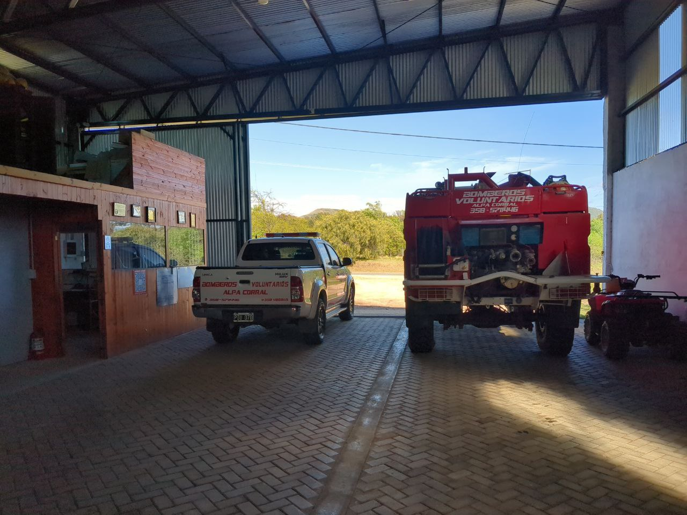

El cuartel dispone además de **sala de comunicaciones, cocina, taller y vestuarios**, todo dentro de un amplio galpón bien ventilado.

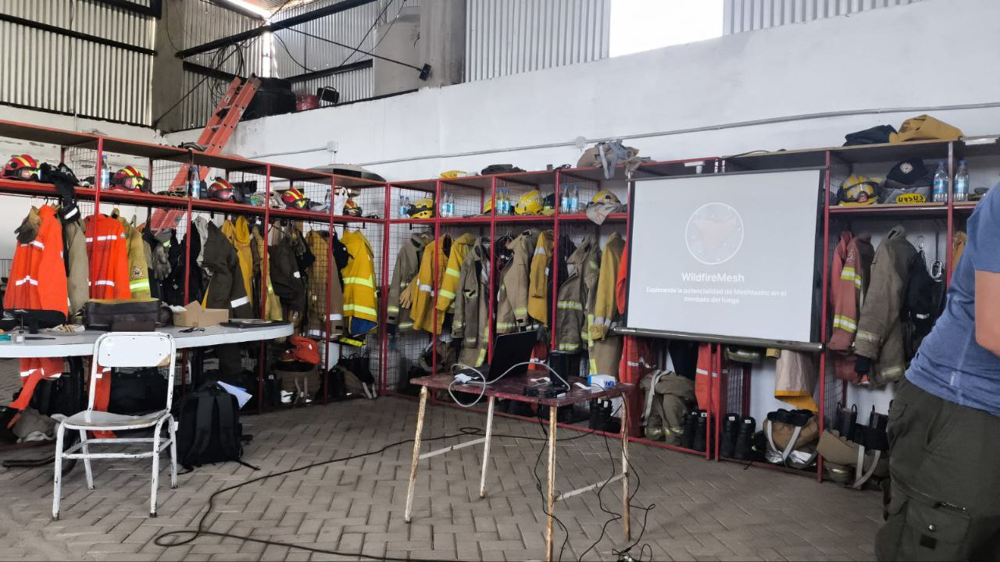

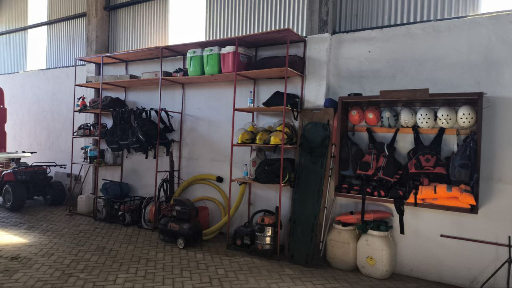

Eber nos contó cómo organizan las **comunicaciones durante los incendios**, que a menudo comienzan al amanecer y pueden extenderse todo el día.
Para mantener el contacto entre el frente de combate y el puesto de mando, deben usar dos handies por grupo: uno para la comunicación con el equipo y otro para intentar enlazar con la repetidora.

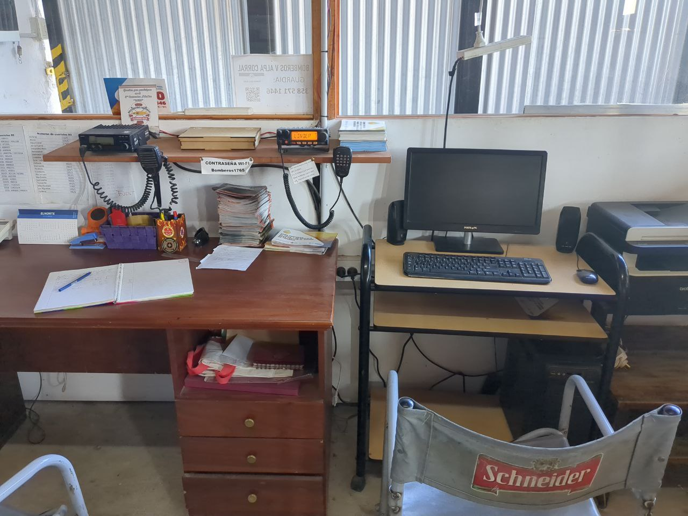

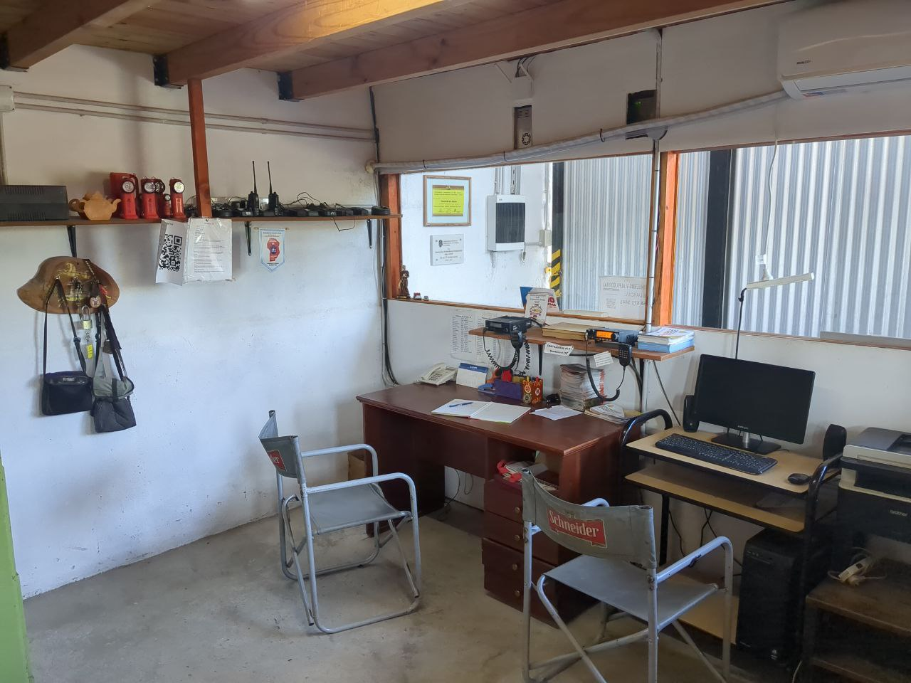

Si bien su repetidora cubre buena parte del territorio, hay zonas como la **Unión de los Ríos** donde **no hay señal ni de radio ni de celular**, lo que los deja completamente incomunicados.

---

## Mapas y coordinación

Al preguntarle si contaban con **mapas impresos de su territorio**, nos comentó que no, aunque mantienen un **mapa digital en Google Earth** con los puntos importantes: accesos, fuentes de agua, límites de cuartel y zonas de riesgo.
Ese mapa se comparte internamente y sirve como referencia cuando se comunican por radio.
En caso de emergencia, **dictan las coordenadas GPS por voz**.

También nos habló de su **coordinación regional**: el cuartel pertenece a la **Regional 4**, que agrupa alrededor de 26 cuarteles, y mantiene contacto con ellos a través de **una frecuencia general de radio** y **grupos de WhatsApp**.

---

## La charla: tecnología abierta para el territorio

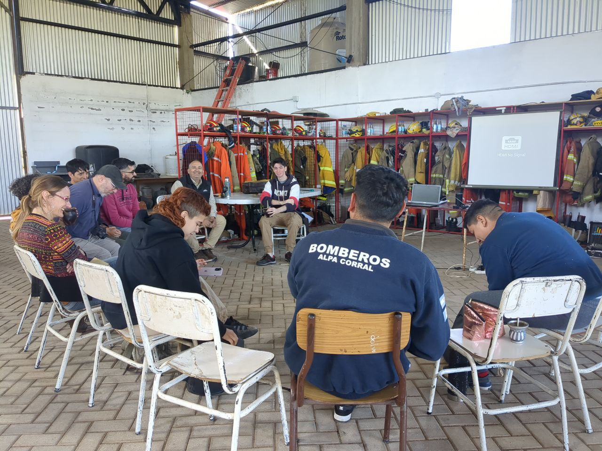

Durante la visita se realizaron dos presentaciones.

Pablo, quien viene colaborando con la Red Comunitaria desde su proyecto de grado de ingeniería, presentó aspectos técnicos sobre **LoRa, LoRaWAN y Meshtastic**, mostrando pruebas de campo y explicando cómo las redes **mesh** pueden ofrecer cobertura donde no hay señal celular.

Luego de esta charla, Nico dió una **charla sobre herramientas abiertas** para mejorar la comunicación y la gestión del fuego.

<iframe
  src="https://hackmd.io/@nicopace/wildfiremesh-presentacion#/"
  width="100%"
  height="400"
  frameBorder="0"
  allowFullScreen
></iframe>

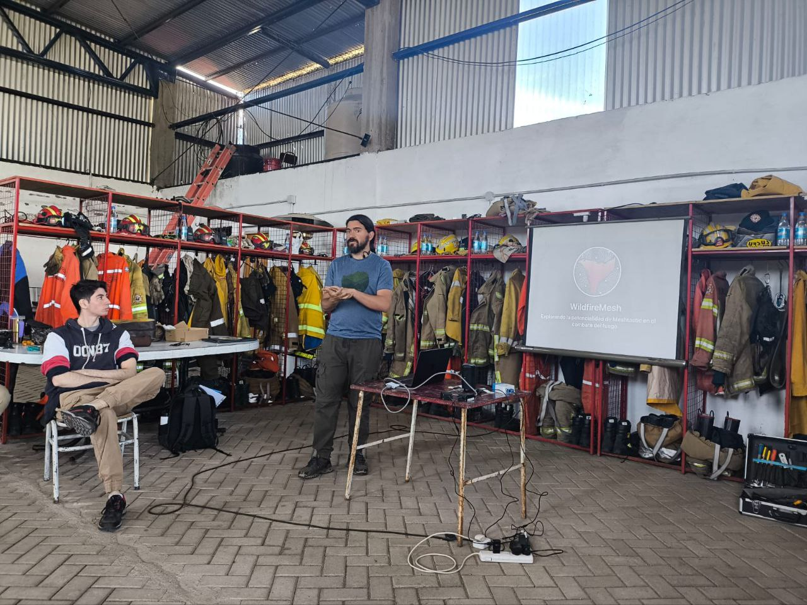

Mientras tanto, fuimos hilando la charla con ejemplos del territorio y experiencias previas.

En medio del taller, los bomberos tuvieron que salir de urgencia a asistir un vehículo accidentado en la ruta, lo que nos recordó que su disponibilidad depende siempre de la emergencia.

Eber regresó hacia el final de la actividad, justo a tiempo para una **práctica breve con los equipos**, junto a otro bombero, **Adolfo**.

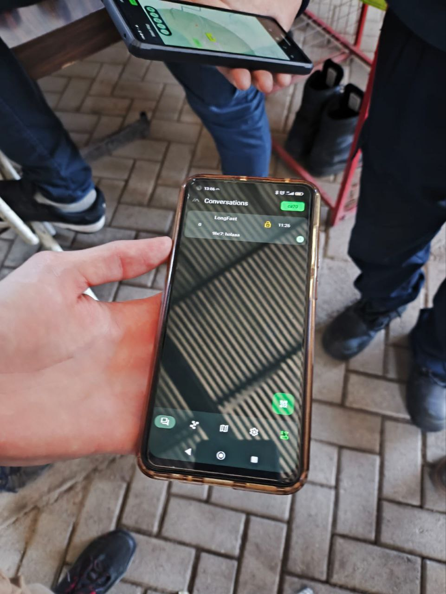

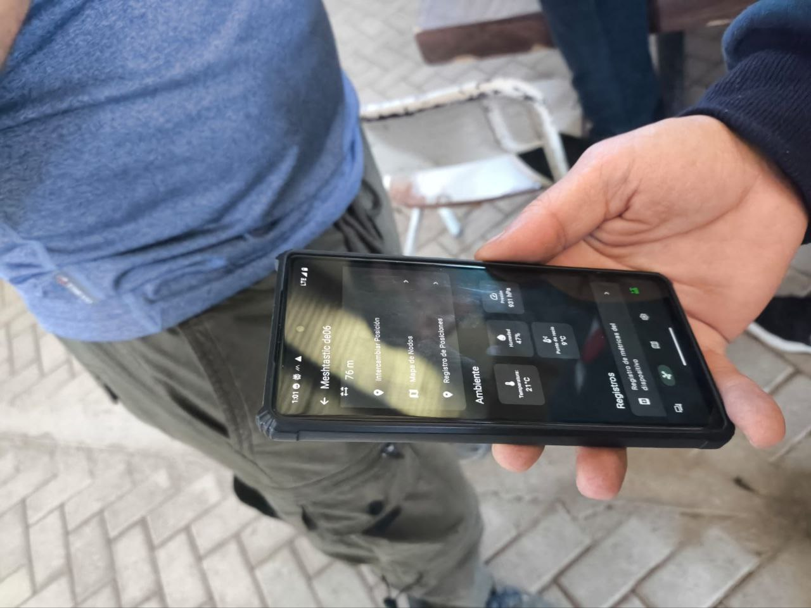

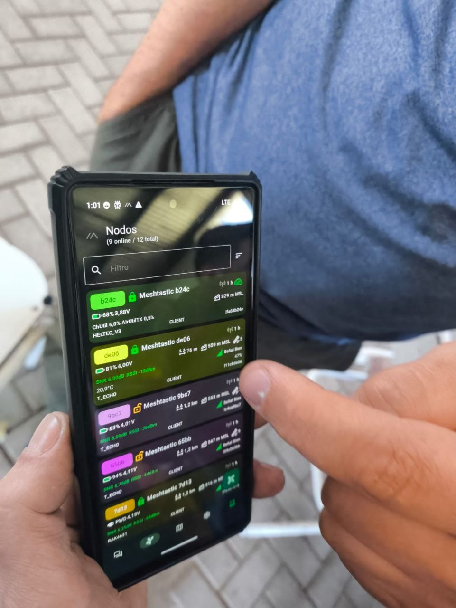

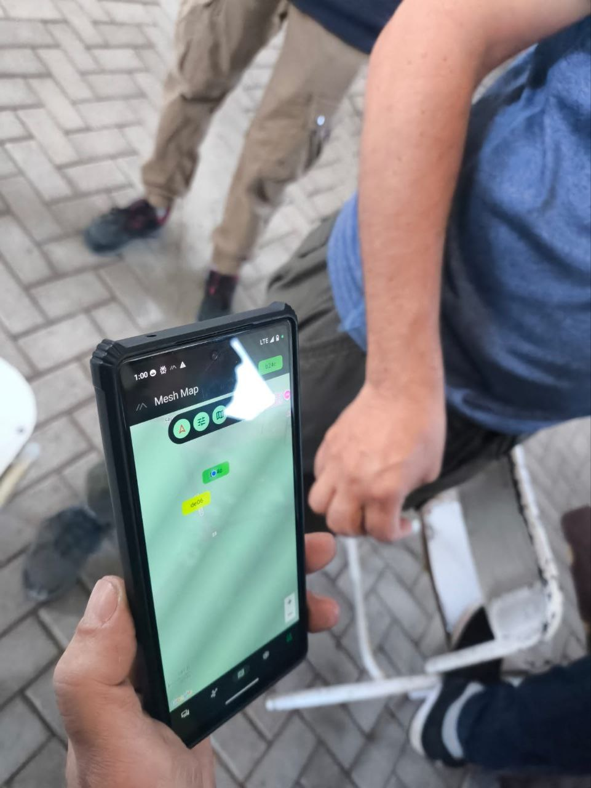

---

## Voces desde la práctica

El aporte de Adolfo fue muy valioso. Nos contó su experiencia reciente combatiendo incendios en **El Chaltén**, donde tuvieron que desplegar **1.200 metros de manguera** cruzando dos montes para apagar un fuego.
En esos contextos, las comunicaciones con la autobomba se pierden, por lo que, al usar radios VHF, algunos compañeros deben quedarse a mitad de camino para hacer de **repetidores humanos**.
Esto implica más esfuerzo físico y menor eficacia en el trabajo.

Al probar la aplicación y los dispositivos Meshtastic, Adolfo destacó que **no le parecieron difíciles de usar**, pese a no considerarse una persona técnica.
Sintió que **la barrera de adopción era baja** y que la herramienta podía **ahorrar tiempo y mejorar la coordinación**, especialmente en tareas logísticas, como avisar cuando abrir o cerrar el paso de agua desde pozos sin cobertura.

---

## Perspectivas y próximos pasos

La reacción general del grupo fue **muy positiva**.
Vieron en estas herramientas **una posibilidad concreta de adaptación al territorio**, no solo para incendios, sino también para **búsqueda de personas, logística y comunicación cotidiana**.

Eber comentó que su **temporada alta de incendios va de noviembre a marzo**, pero que a partir de **abril** podrían dedicar tiempo a **probar y mejorar la herramienta junto a nosotros**.
Quedamos en mantener el contacto y seguir colaborando con ellos y con el equipo del proyecto regional.

---

## Reflexiones finales

Esta experiencia en Alpa Corral fue **una confirmación de la importancia del encuentro entre tecnología abierta y saberes locales**.
Cada conversación con los bomberos nos permitió entender mejor las **limitaciones reales de comunicación en el monte** y la **potencialidad enorme** que tienen las redes comunitarias y descentralizadas para acompañar su trabajo.

Seguimos convencidos de que **la construcción de tecnología útil empieza escuchando al territorio**.
Y este fue un paso más en ese camino compartido.
